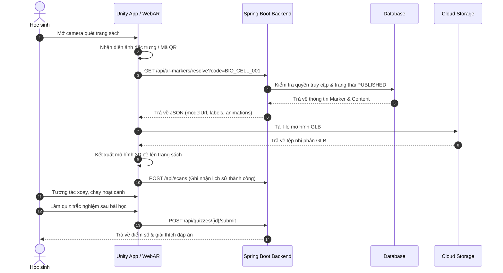
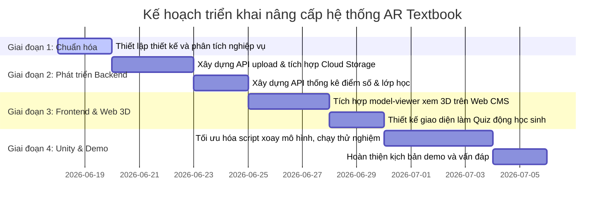

# TÀI LIỆU KHẢO SÁT, PHÂN TÍCH VÀ ĐẶC TẢ THIẾT KẾ HỆ THỐNG
## ĐỀ TÀI: XÂY DỰNG ỨNG DỤNG AR HỖ TRỢ HIỂN THỊ NỘI DUNG 3D TỪ SÁCH GIÁO KHOA

---

## PHẦN A — TỔNG QUAN KHẢO SÁT

### 1. Tổng quan đề tài
Trong thời kỳ chuyển đổi số giáo dục, việc truyền tải kiến thức từ sách giáo khoa (SGK) truyền thống gặp nhiều rào cản do tính chất tĩnh của hình ảnh và văn bản. Đề tài **"Xây dựng ứng dụng AR hỗ trợ hiển thị nội dung 3D từ sách giáo khoa"** nhằm mục đích trực quan hóa các kiến thức phức tạp (thuộc các môn Sinh học, Vật lý, Hóa học, Địa lý, v.v.) dưới dạng mô hình 3D, hoạt cảnh sinh động, âm thanh và thuyết minh tương tác trực tiếp trên trang sách thông qua công nghệ thực tế tăng cường (AR).
Hệ thống cho phép học sinh quét trang sách, hình ảnh hoặc mã QR để hiển thị nội dung 3D trực quan, thực hiện các tương tác xoay, phóng to, thu nhỏ và làm bài kiểm tra nhanh (quiz) để đánh giá mức độ hiểu bài. Đồng thời, giáo viên có thể theo dõi tiến độ và giao bài tập, còn quản trị viên nội dung (Content Manager) có thể cập nhật các mô hình 3D và marker tương ứng.

---

### 2. Khảo sát ứng dụng thực tế

#### 2.1. Ứng dụng Assemblr Edu
* **Tên ứng dụng:** Assemblr Edu
* **Link nguồn:** [https://www.assemblrworld.com/assemblr-edu](https://www.assemblrworld.com/assemblr-edu)
* **Loại dự án:** Sản phẩm thương mại & Giáo dục.
* **Mục tiêu:** Cung cấp nền tảng cho giáo viên và học sinh tạo dựng, chia sẻ và học tập các bài học thông qua mô hình 3D/AR trực quan.
* **Đối tượng sử dụng:** Học sinh, Giáo viên các cấp học phổ thông.
* **Công nghệ sử dụng:** Unity, ARCore, ARKit, Cloud Storage.
* **Các chức năng chính:** 
  - Thư viện hàng ngàn mô hình 3D giáo dục có sẵn.
  - Trình biên soạn 3D đơn giản trên di động và web.
  - Quét marker hoặc hiển thị mô hình dạng markerless (trên mặt phẳng).
  - Quản lý lớp học ảo (Classroom) để giao bài tập 3D.
* **Cách hoạt động của nghiệp vụ AR:** Người dùng mở bài học, chọn quét AR, camera sẽ nhận diện một thẻ hình ảnh (marker) được in sẵn hoặc tự nhận diện mặt phẳng sàn để đặt mô hình 3D lên đó.
* **Cách quản lý nội dung 3D:** Lưu trữ trên Cloud của Assemblr dưới dạng các gói assetBundle tối ưu.
* **Cách nhận diện marker/image/QR:** Nhận diện thông qua thuật toán quét ảnh của riêng nền tảng (dựa trên các điểm đặc trưng hình học).
* **Điểm hay có thể học hỏi:** Giao diện lớp học trực quan, cho phép học sinh tương tác lắp ráp mô hình trực tiếp trong không gian AR.
* **Hạn chế:** Bản miễn phí bị giới hạn dung lượng và số lượng mô hình 3D; yêu cầu kết nối mạng ổn định để tải các asset dung lượng lớn.
* **Áp dụng cho đề tài:** Có thể học hỏi cấu trúc quản lý danh mục môn học, bài học và cơ chế hiển thị chú thích (label) 3D động.
* **Mức độ liên quan với project hiện tại:** Cao (về mặt luồng học tập và quản lý lớp học).

#### 2.2. Ứng dụng Quiver (Quiver 3D Coloring App)
* **Tên ứng dụng:** Quiver - 3D Coloring App
* **Link nguồn:** [https://quivervision.com/](https://quivervision.com/)
* **Loại dự án:** Sản phẩm thương mại.
* **Mục tiêu:** Biến các trang tranh tô màu giấy của học sinh thành các mô hình 3D chuyển động tương tác đúng với màu sắc mà các em vừa tô.
* **Đối tượng sử dụng:** Trẻ em, Học sinh mầm non và tiểu học.
* **Công nghệ sử dụng:** Unity, Vuforia Engine (Image Tracking với công nghệ quét màu động Texture Mapping).
* **Các chức năng chính:**
  - Tải về và in các trang tô màu mẫu (marker).
  - Quét trang tô màu để mô hình 3D nổi lên khớp hoàn toàn với màu sắc học sinh vẽ trên giấy.
  - Chơi các trò chơi giáo dục và quiz đi kèm bài học.
* **Cách hoạt động của nghiệp vụ AR:** Khi quét trang vẽ, hệ thống bắt tọa độ 4 góc của trang giấy, ánh xạ chất liệu màu vẽ thực tế đè lên lưới (mesh) của mô hình 3D động.
* **Cách quản lý nội dung 3D:** Đóng gói sẵn trong ứng dụng di động hoặc tải động theo gói gói nội dung (DLC).
* **Cách nhận diện marker/image/QR:** Nhận diện biên dạng và các hoa văn mã hóa đặc trưng trên viền bức tranh tô màu.
* **Điểm hay có thể học hỏi:** Khả năng tương tác cực cao và tính sáng tạo khi kết hợp học tập offline (tô màu giấy) và online (AR).
* **Hạn chế:** Nội dung cố định theo các trang vẽ có sẵn, người dùng không thể tự thêm mô hình 3D bên ngoài vào.
* **Áp dụng cho đề tài:** Ý tưởng sử dụng các trang sách giáo khoa thực tế (như các hình vẽ cấu tạo cơ thể người, tế bào sinh học) làm chính marker để quét.
* **Mức độ liên quan với project hiện tại:** Trung bình.

#### 2.3. Ứng dụng JigSpace
* **Tên ứng dụng:** JigSpace
* **Link nguồn:** [https://jig.space/](https://jig.space/)
* **Loại dự án:** Sản phẩm thương mại.
* **Mục tiêu:** Cho phép tạo và chia sẻ các hướng dẫn từng bước (Jigs) bằng mô hình 3D/AR để giải thích cấu tạo máy móc, hiện tượng khoa học.
* **Đối tượng sử dụng:** Sinh viên, Giáo viên kỹ thuật, Kỹ sư, Đào tạo nội bộ doanh nghiệp.
* **Công nghệ sử dụng:** Unity, WebXR, ARKit, USDZ/GLTF format.
* **Các chức năng chính:**
  - Hiển thị mô hình 3D tháo lắp từng phần (Exploded view).
  - Xem tài liệu hướng dẫn từng bước (Step-by-step instructions).
  - Chú thích nhãn dạng 3D chỉ thẳng vào các cấu tử của vật thể.
* **Cách hoạt động của nghiệp vụ AR:** Quét sàn đặt vật thể quy mô thực tế hoặc quét mã QR gắn với liên kết bài học để mở AR trên Web hoặc ứng dụng di động.
* **Cách quản lý nội dung 3D:** Cho phép import mô hình CAD/3D trực tiếp trên Web CMS và quản lý các bước hoạt cảnh trực tuyến.
* **Cách nhận diện marker/image/QR:** Quét mã QR dẫn link đến trang WebAR hoặc dùng nhận dạng mặt phẳng.
* **Điểm hay có thể học hỏi:** Giao diện xem tháo lắp từng bước cực kỳ chuyên nghiệp và khả năng chạy mượt mà trên nền tảng Web (WebAR) không cần cài app.
* **Hạn chế:** Đòi hỏi cấu hình phần cứng thiết bị di động mạnh mẽ để xử lý các mô hình nhiều đa giác (polygon count lớn).
* **Áp dụng cho đề tài:** Thiết kế luồng cho phép học sinh bấm chuyển bước (Next/Back) để xem từng thành phần tế bào hoặc hoạt cảnh của động cơ vật lý.
* **Mức độ liên quan với project hiện tại:** Cao (về mặt tương tác mô hình và cấu trúc hoạt cảnh).

#### 2.4. Ứng dụng Arloopa
* **Tên ứng dụng:** Arloopa
* **Link nguồn:** [https://arloopa.com/](https://arloopa.com/)
* **Loại dự án:** Nền tảng thương mại dịch vụ AR toàn diện.
* **Mục tiêu:** Mang thế giới ảo vào thực tế thông qua các nội dung giáo dục, tiếp thị và nghệ thuật bằng AR.
* **Đối tượng sử dụng:** Học sinh, Giáo viên, Nhà làm nội dung truyền thông.
* **Công nghệ sử dụng:** Unity, ARCore, ARKit, Vuforia, WebAR.
* **Các chức năng chính:**
  - Quét marker ảnh để chạy video, nhạc, hoạt cảnh 3D.
  - Thư viện phân loại rõ các chủ đề khoa học (Anatomy, Biology, Chemistry, Physics, Space).
  - Cho phép chụp hình, quay video mô hình trong không gian thực để chia sẻ.
* **Cách hoạt động của nghiệp vụ AR:** Chọn chủ đề hoặc bật camera quét hình ảnh marker tương ứng để hiển thị mô hình.
* **Cách quản lý nội dung 3D:** Cơ sở dữ liệu đám mây lớn, tải động asset theo API truy vấn marker.
* **Cách nhận diện marker/image/QR:** Image tracking và QR tracking.
* **Điểm hay có thể học hỏi:** Hệ thống phân loại danh mục (Catalog) khoa học rõ ràng, luồng quét marker nhạy.
* **Hạn chế:** Nhiều nội dung giáo dục chất lượng cao yêu cầu trả phí; quảng cáo xuất hiện trong phiên bản free.
* **Áp dụng cho đề tài:** Phương pháp lấy dữ liệu model động từ đám mây dựa trên mã marker quét được để giảm dung lượng tải app ban đầu.
* **Mức độ liên quan với project hiện tại:** Cao.

#### 2.5. Ứng dụng Merge Explorer
* **Tên ứng dụng:** Merge Explorer (kết hợp với Merge Cube)
* **Link nguồn:** [https://mergeedu.com/explorer](https://mergeedu.com/explorer)
* **Loại dự án:** Giáo dục thương mại.
* **Mục tiêu:** Giúp học sinh chạm và tương tác với các khái niệm khoa học (như hệ mặt trời, núi lửa, tế bào, ếch) bằng cách hiển thị chúng phủ lên khối lập phương Merge Cube.
* **Đối tượng sử dụng:** Học sinh phổ thông, Giáo viên dạy môn Khoa học (STEM).
* **Công nghệ sử dụng:** Unity, AR Foundation, Vuforia Object Tracking.
* **Các chức năng chính:**
  - Tương tác đa chiều với các mô hình 3D khoa học thông qua việc xoay khối lập phương Merge trên tay.
  - Các bài đọc khoa học ngắn, thuyết minh giọng nói đi kèm.
  - Các quiz ngắn kiểm tra bài học tích hợp sẵn.
* **Cách hoạt động của nghiệp vụ AR:** Camera nhận diện khối lập phương Merge Cube (marker 3 chiều) và hiển thị mô hình 3D bọc xung quanh khối lập phương đó.
* **Cách quản lý nội dung 3D:** Dữ liệu học tập được quản lý qua cổng Merge Dashboard dành cho giáo viên và trường học.
* **Cách nhận diện marker/image/QR:** Nhận diện hoa văn nhị phân (binary pattern) đặc trưng trên 6 mặt của khối Merge Cube.
* **Điểm hay có thể học hỏi:** Tương tác cầm nắm vật thể ảo cực kỳ tự nhiên, kích thích hứng thú của học sinh.
* **Hạn chế:** Bắt buộc phải có phụ kiện vật lý (Merge Cube) để trải nghiệm tối đa; bản quyền dịch vụ đắt đỏ.
* **Áp dụng cho đề tài:** Có thể phát triển một khối marker giấy tự lắp ghép giá rẻ cho học sinh quét thay vì chỉ quét hình phẳng trên trang sách.
* **Mức độ liên quan với project hiện tại:** Trung bình.

---

### 3. Khảo sát repository GitHub

#### 3.1. Repository AR.js
* **Tên repository:** AR-js-org / AR.js
* **Link nguồn:** [https://github.com/AR-js-org/AR.js](https://github.com/AR-js-org/AR.js)
* **Loại dự án:** Open-source (MIT License).
* **Mục tiêu:** Cung cấp thư viện WebAR siêu nhẹ chạy trực tiếp trên trình duyệt di động mà không cần cài đặt ứng dụng.
* **Đối tượng sử dụng:** Lập trình viên Web.
* **Công nghệ sử dụng:** JavaScript, WebGL, A-Frame, Three.js, jsartoolkit5.
* **Các chức năng chính:**
  - Nhận diện Marker (như Hiro marker, Barcode marker).
  - Nhận diện Hình ảnh (Image Tracking - Natural Feature Tracking - NFT).
  - Định vị vị trí địa lý (Location-based AR).
* **Cách hoạt động của nghiệp vụ AR:** Thư viện sử dụng luồng camera từ trình duyệt, tính năng xử lý ảnh của jsartoolkit5 để ước lượng ma trận tư thế (pose matrix) và vẽ mô hình 3D của A-Frame/Three.js đè lên.
* **Cách quản lý nội dung 3D:** Khai báo trực tiếp đường dẫn file GLTF/OBJ trong mã nguồn HTML hoặc load động qua JavaScript.
* **Cách nhận diện marker/image/QR:** Sử dụng thuật toán so khớp đặc trưng ảnh NFT và nhận dạng mẫu hình ảnh (pattern) được huấn luyện trước (.patt).
* **Điểm hay có thể học hỏi:** Không cần cài app, tương thích với hầu hết điện thoại thông minh qua trình duyệt web.
* **Hạn chế:** Hiệu năng nhận diện hình ảnh (NFT) trên Web đôi khi bị trễ; việc hiển thị mô hình lớn dễ gây giật lag trình duyệt.
* **Áp dụng cho đề tài:** Phục vụ hoàn hảo cho hướng phát triển WebAR của hệ thống hiển thị SGK, giúp học sinh quét QR trên sách là mở ra bài học ngay trên điện thoại.
* **Mức độ liên quan với project hiện tại:** Cao (nếu triển khai WebAR).

#### 3.2. Repository mind-ar-js
* **Tên repository:** hiukim / mind-ar-js
* **Link nguồn:** [https://github.com/hiukim/mind-ar-js](https://github.com/hiukim/mind-ar-js)
* **Loại dự án:** Open-source (MIT License).
* **Mục tiêu:** Thư viện WebAR nhận diện hình ảnh và khuôn mặt, thay thế nhẹ nhàng hơn cho AR.js với hiệu năng tracking mượt mà hơn.
* **Đối tượng sử dụng:** Lập trình viên Web Front-end.
* **Công nghệ sử dụng:** JavaScript, TensorFlow.js, WebGL.
* **Các chức năng chính:**
  - Nhận diện và theo dõi nhiều hình ảnh cùng lúc (Multiple Image Tracking).
  - Nhận diện và bám theo khuôn mặt (Face Tracking).
  - Trình biên dịch CLI biên soạn file target hình ảnh (.mind).
* **Cách hoạt động của nghiệp vụ AR:** Sử dụng mô hình học máy TensorFlow.js chạy dưới nền Web Assembly để nhận diện các điểm đặc trưng hình học của ảnh làm target tracking.
* **Cách quản lý nội dung 3D:** Sử dụng A-Frame làm phần hiển thị mô hình 3D.
* **Cách nhận diện marker/image/QR:** Xử lý và so khớp các điểm đặc trưng (features) của file target được compile sẵn.
* **Điểm hay có thể học hỏi:** Khả năng tracking hình ảnh rất ổn định trên môi trường Web di động, biên dịch file target offline dễ dàng qua công cụ web kéo thả.
* **Hạn chế:** Chưa tích hợp định vị địa lý hoặc nhận diện vật thể 3D phức tạp.
* **Áp dụng cho đề tài:** Xây dựng tính năng quét trang sách giáo khoa trên Web mà không cần các ký hiệu mã QR hay marker phức tạp bao quanh hình ảnh.
* **Mức độ liên quan với project hiện tại:** Cao.

#### 3.3. Repository Unity AR Foundation Samples
* **Tên repository:** Unity-Technologies / arfoundation-samples
* **Link nguồn:** [https://github.com/Unity-Technologies/arfoundation-samples](https://github.com/Unity-Technologies/arfoundation-samples)
* **Loại dự án:** Open-source mẫu của Unity (MIT License).
* **Mục tiêu:** Cung cấp mã nguồn mẫu cho việc sử dụng AR Foundation để viết app chạy đa nền tảng (Android/iOS).
* **Đối tượng sử dụng:** Lập trình viên Unity C#.
* **Công nghệ sử dụng:** Unity C#, AR Foundation, ARCore, ARKit.
* **Các chức năng chính:**
  - Nhận diện ảnh (AR Tracked Image Manager).
  - Phát hiện mặt phẳng (AR Plane Manager).
  - Tương tác chạm, xoay, phóng to mô hình (Raycasting & Gestures).
  - Nhận diện môi trường ánh sáng (Light Estimation).
* **Cách hoạt động của nghiệp vụ AR:** AR Foundation đóng vai trò lớp bọc (wrapper) gọi trực tiếp SDK ARCore của Android hoặc ARKit của iOS ở mức hệ thống để thực hiện tracking.
* **Cách quản lý nội dung 3D:** Quản lý qua Prefab của Unity, liên kết qua Reference Image Library.
* **Cách nhận diện marker/image/QR:** Tạo thư viện ảnh tham chiếu (Reference Image Library) trong Unity Editor để nhận dạng trực tiếp camera.
* **Điểm hay có thể học hỏi:** Hiệu năng tracking ảnh đạt chuẩn chất lượng cao nhất nhờ chạy native trên thiết bị di động.
* **Hạn chế:** Bắt buộc phải đóng gói ứng dụng (APK/IPA) để cài đặt, không thể chạy nhanh qua trình duyệt web.
* **Áp dụng cho đề tài:** Phát triển Unity app trong dự án, đặc biệt là các script xử lý xoay/phóng to mô hình bằng ngón tay và tải mô hình từ backend.
* **Mức độ liên quan với project hiện tại:** Cao (Cơ sở trực tiếp nâng cấp ứng dụng Unity).

#### 3.4. Repository Google model-viewer
* **Tên repository:** google / model-viewer
* **Link nguồn:** [https://github.com/google/model-viewer](https://github.com/google/model-viewer)
* **Loại dự án:** Open-source (Apache 2.0 License).
* **Mục tiêu:** Thành phần web (Web Component) giúp nhúng và hiển thị mô hình 3D tương tác trên trang Web dễ dàng như chèn một thẻ hình ảnh.
* **Đối tượng sử dụng:** Lập trình viên Web.
* **Công nghệ sử dụng:** JavaScript, Three.js, WebXR, LitElement.
* **Các chức năng chính:**
  - Hiển thị mô hình GLB/GLTF/USDZ xoay 360 độ trên trình duyệt.
  - Hỗ trợ nút kích hoạt AR mở Scene Viewer (Android) hoặc Quick Look (iOS) để xem thực tế.
  - Quản lý ánh sáng, bóng đổ, hoạt cảnh (animation) của mô hình.
  - Tạo điểm chú thích (Hotspots) trên mô hình.
* **Cách hoạt động của nghiệp vụ AR:** Khi nhấn nút AR, ứng dụng sẽ chuyển hướng camera sang chế độ AR hệ điều hành của máy để đưa mô hình ra thế giới thực.
* **Cách quản lý nội dung 3D:** Khai báo qua thuộc tính `src` (đường dẫn URL file .glb).
* **Cách nhận diện marker/image/QR:** Nhận diện mặt phẳng nền (markerless).
* **Điểm hay có thể học hỏi:** Nhúng cực kỳ đơn giản vào trang quản trị CMS giúp Content Manager xem trước (Preview) mô hình 3D ngay trên web mà không cần cài app hay Unity.
* **Hạn chế:** Tính năng AR phụ thuộc hoàn toàn vào hỗ trợ ARCore/ARKit của thiết bị; không tự động nhận diện hình ảnh trong sách giáo khoa để phủ mô hình lên vị trí đó.
* **Áp dụng cho đề tài:** Xây dựng màn hình Preview mô hình 3D trên Web CMS cho Admin và Content Manager.
* **Mức độ liên quan với project hiện tại:** Cao (Dùng để hoàn thiện phần CMS Web).

#### 3.5. Repository Three.js
* **Tên repository:** mrdoob / three.js
* **Link nguồn:** [https://github.com/mrdoob/three.js](https://github.com/mrdoob/three.js)
* **Loại dự án:** Open-source (MIT License).
* **Mục tiêu:** Thư viện đồ họa 3D chuẩn hóa cho JavaScript trên trình duyệt.
* **Đối tượng sử dụng:** Lập trình viên Web 3D.
* **Công nghệ sử dụng:** JavaScript, WebGL, WebXR.
* **Các chức năng chính:**
  - Dựng hình, tạo camera, ánh sáng, vật liệu (materials).
  - Tải mô hình 3D định dạng OBJ, GLTF, FBX.
  - Hỗ trợ xây dựng các tương tác vật lý và bộ dựng AR/VR.
* **Cách hoạt động của nghiệp vụ AR:** Hỗ trợ WebXR API giúp truy cập trực tiếp vào luồng dữ liệu camera và cảm biến định vị của điện thoại.
* **Cách quản lý nội dung 3D:** Tải động qua các Loader (như GLTFLoader).
* **Cách nhận diện marker/image/QR:** Không tích hợp sẵn nhận diện hình ảnh (phải kết hợp với các thư viện khác như AR.js hoặc OpenCV).
* **Điểm hay có thể học hỏi:** Khả năng tùy biến giao diện đồ họa 3D sâu nhất trên môi trường web.
* **Hạn chế:** Đường cong học tập dốc, lập trình viên phải tự quản lý hiệu năng vẽ và các sự kiện chạm xoay.
* **Áp dụng cho đề tài:** Làm nền tảng nếu muốn tự viết phần tương tác 3D tùy biến cao trên Web của học sinh.
* **Mức độ liên quan với project hiện tại:** Trung bình.

---

### 4. So sánh các dự án đã khảo sát

| Tên dự án | Loại dự án | Công nghệ cốt lõi | Nhận diện Marker | Quản lý nội dung 3D | Hỗ trợ tương tác | Khả năng chạy Offline | Mức độ phù hợp |
| :--- | :--- | :--- | :--- | :--- | :--- | :--- | :--- |
| **Assemblr Edu** | Thương mại | Unity, ARCore, ARKit | Có (Ảnh & Sàn) | Đám mây riêng | Cao (Lớp học, tạo hình) | Không | Cao |
| **Quiver** | Thương mại | Unity, Vuforia | Có (Trang tô màu) | Đóng gói / Tải DLC | Trung bình (Hoạt cảnh, game) | Có một phần | Trung bình |
| **JigSpace** | Thương mại | WebXR, Unity | Có (QR / Sàn) | Đám mây riêng | Rất cao (Tháo lắp, chú giải) | Không | Cao |
| **Arloopa** | Thương mại | Unity, Vuforia | Có (Ảnh & QR) | Đám mây riêng | Trung bình (Xem, xoay) | Không | Cao |
| **Merge Explorer**| Thương mại | Unity, AR Foundation | Có (Merge Cube) | Đám mây riêng | Rất cao (Xoay cube vật lý) | Có một phần | Trung bình |
| **AR.js** | Open-source | A-Frame, Three.js | Có (Hiro, NFT) | Local / URL file | Trung bình (Dùng HTML/JS) | Có | Rất cao |
| **mind-ar-js** | Open-source | TensorFlow.js | Có (NFT Image) | Local / URL file | Trung bình (A-Frame) | Có | Cao |
| **AR Foundation** | Open-source | Unity, C#, C++ | Có (Image Lib) | Unity Assets / Addressables | Rất cao (C# Unity) | Có | Rất cao |
| **model-viewer** | Open-source | Three.js, WebXR | Không (Chỉ Sàn) | URL file GLB | Trung bình (Xoay, scale) | Có | Cao |
| **three.js** | Open-source | WebGL, WebXR | Không | Lập trình thủ công | Tùy biến hoàn toàn | Có | Trung bình |

---

### 5. Bài học rút ra cho đề tài
1. **Phương pháp nhận diện:** Image Tracking là phương pháp tối ưu nhất cho sách giáo khoa. Thay vì bắt học sinh dùng các marker ký hiệu đen trắng làm xấu sách, việc dùng chính trang vẽ, hình minh họa cấu tạo trong SGK làm marker (Natural Feature Tracking - NFT) giúp trải nghiệm học tập tự nhiên và thẩm mỹ nhất.
2. **Kiến trúc dữ liệu động:** Không nên lưu cứng mô hình 3D trong ứng dụng Unity để tránh app quá nặng. Cần lưu mô hình dưới dạng file `.glb` trên Cloud Storage (như Cloudinary, Firebase Storage) và dùng API resolve để Unity hoặc Web tải mô hình tương ứng về khi quét marker thành công.
3. **Cơ chế hoạt cảnh & nhãn chú thích (Labels):** Để nâng cao hiệu quả học tập, mô hình 3D cần đi kèm nhãn chú thích động định vị tọa độ tương đối trên mô hình (ví dụ: chỉ rõ vị trí của màng tế bào, nhân tế bào, ty thể) và hoạt cảnh (chạy thử sự trao đổi chất của tế bào).
4. **Tích hợp Quiz & Tiến độ học tập:** Điểm khác biệt lớn giữa một app học tập nghiêm túc và một app xem mô hình đơn giản là hệ thống kiểm tra nhanh (quiz) ngay sau khi học sinh quét và tương tác với bài học, ghi nhận tiến độ vào học bạ số của hệ thống.

---

## PHẦN B — PHÂN TÍCH PROJECT HIỆN TẠI

### 6. Tổng quan project hiện tại
* **Tên project:** AR Textbook 3D Learning System.
* **Mục tiêu hiện tại:** Xây dựng phiên bản MVP hỗ trợ học sinh quét marker trang sách giáo khoa để hiển thị nội dung 3D tương ứng, liên kết với hệ thống quản lý học tập, bài tập, lớp học và tiến độ.
* **Kiến trúc tổng quan:** Hệ thống bao gồm 3 phần chính:
  1. **Database:** PostgreSQL lưu trữ thông tin thực thể (User, Course, Marker, Model, Quiz, Progress, Feedback...).
  2. **Backend Web (Spring Boot):** Thực hiện quản lý toàn bộ nghiệp vụ quản trị, cung cấp trang Web CMS Thymeleaf cho các role Admin, Teacher, Content Manager và Student, đồng thời cung cấp REST API cho Unity Client.
  3. **Unity Client:** Đọc luồng camera webcam thông qua Vuforia Engine để nhận dạng các marker mẫu, gọi REST API của Spring Boot để tải thông tin mô hình 3D tương ứng và hiển thị tương tác.

---

### 7. Công nghệ project hiện tại
* **Backend:** Java 21, Spring Boot 3.5.x, Spring Data JPA, Spring Security (đăng nhập bằng email/password, phân quyền RBAC), JdbcTemplate để tối ưu hóa các truy vấn báo cáo và thống kê nhanh.
* **Frontend Web:** Thymeleaf kết hợp Bootstrap 5 cho giao diện quản trị và bảng điều khiển người dùng.
* **Database & Migration:** PostgreSQL kết hợp thư viện Flyway Migration để kiểm soát phiên bản cơ sở dữ liệu tự động.
* **Unity Client:** Unity 2022.3 LTS, Vuforia Engine 11.4.4, ngôn ngữ lập trình C#, UnityWebRequest cho các tác vụ gọi API mạng.
* **Định dạng 3D:** Chuẩn GLB/GLTF.
* **Môi trường triển khai demo:** Chạy backend cục bộ trên cổng `8080` (hoặc `8081`), kết nối database PostgreSQL (Railway/Local). Unity Editor chạy trong chế độ Webcam Play Mode giả lập thiết bị di động quét marker thật.

---

### 8. Chức năng hiện có
* **Nghiệp vụ cốt lõi:**
  - Tìm và khớp marker: API `GET /api/ar-markers/resolve?code={code}` trả về thông tin chi tiết của marker đang quét bao gồm mã bài học, mô hình 3D mặc định (.glb), danh sách nhãn chú giải (labels) và danh sách tên hoạt cảnh (animations) hợp lệ.
  - Phân quyền dữ liệu (Access Guard): Học sinh chỉ xem được nội dung bài học thuộc các sách giáo khoa được phân công cho lớp học của mình (`class_textbooks`). Giáo viên chỉ theo dõi được lớp học mình giảng dạy (`teacher_classes`).
  - Ghi nhận tiến độ học tập: Tự động ghi lại lịch sử quét marker (`scan_history`) và tiến trình học bài (`learning_progress`).
  - Hệ thống Quiz kiểm tra: Hỗ trợ làm quiz trắc nghiệm, tính điểm và lưu lịch sử nỗ lực làm bài (`quiz_attempts`, `quiz_attempt_answers`).
  - Chức năng Báo lỗi (Feedback): Cho phép người dùng tạo yêu cầu báo cáo lỗi quét marker, lỗi hiển thị mô hình 3D.
  - Giao bài tập (Teacher Assignment): Giáo viên có thể giao bài tập bắt buộc học sinh phải quét xem mô hình AR và hoàn thành quiz của bài học đó.
  - Duyệt nội dung (Content Review Queue): Quy trình gửi duyệt nội dung AR (`content_review_requests`) từ Content Manager lên Admin để phê duyệt trước khi xuất bản.
* **Trang Web Thymeleaf MVP:**
  - Trang chủ (`/`), Trang đăng nhập (`/login`), Hướng dẫn sử dụng (`/guide`).
  - Trang Dashboard dùng chung hiển thị danh sách các bản ghi mới nhất của Marker (CMS), Người dùng (Admin), Bài tập giao (Teacher), hoặc Tiến độ học tập (Student) thông qua cơ chế nạp trang mẫu `page.html` động.

---

### 9. Role hiện có
Hệ thống hiện tại phân quyền rõ ràng thành 4 vai trò chính thông qua Spring Security:
1. **ADMIN:** Quản trị toàn bộ hệ thống, quản lý người dùng, duyệt nội dung AR từ hàng chờ duyệt, xem thống kê hệ thống toàn diện.
2. **CONTENT_MANAGER:** Người xây dựng cơ sở dữ liệu học liệu. Có quyền quản lý Môn học, Sách giáo khoa, Chương, Bài học, Upload tệp mô hình 3D, Upload hình ảnh Marker, gắn kết Marker với Mô hình và gửi yêu cầu kiểm duyệt.
3. **TEACHER:** Quản lý lớp học được phân công, xem tiến độ học tập của học sinh, giao bài tập AR, chấm quiz và gửi nhận xét.
4. **STUDENT:** Học sinh tham gia quét bài học qua camera (Unity client), xem học bạ trực tuyến, làm quiz bài tập, xem lịch sử quét của bản thân và gửi phản hồi báo lỗi.
*(Lưu ý: Vai trò Guest - khách chưa đăng nhập chỉ được phép xem trang Landing và Hướng dẫn, không lưu trữ trong database).*

---

### 10. Database/API hiện có

#### 10.1. Database hiện có
Gồm 22 bảng chính được tạo thông qua Flyway migration trong file `V1__create_ar_textbook_schema.sql`:
1. `users`, `roles`, `user_roles`: Quản lý tài khoản và quyền.
2. `user_devices`: Lưu cấu hình và thông tin hỗ trợ AR của thiết bị học sinh.
3. `schools`, `grades`, `classes`, `class_students`, `teacher_classes`: Quản lý trường, khối lớp và phân công giảng dạy.
4. `subjects`, `textbooks`, `class_textbooks`, `chapters`, `lessons`, `textbook_pages`: Quản lý cơ cấu chương trình học và tài liệu sách giáo khoa.
5. `ar_markers`, `three_d_models`, `ar_contents`, `ar_content_models`, `model_labels`, `animations`, `media_assets`: Quản lý các tài nguyên đồ họa thực tế tăng cường và chú giải.
6. `content_versions`, `content_review_requests`: Quản lý quy trình kiểm duyệt và phiên bản nội dung AR.
7. `quizzes`, `quiz_questions`, `quiz_answers`, `quiz_attempts`, `quiz_attempt_answers`: Hệ thống kiểm tra kiến thức.
8. `learning_progress`, `scan_history`, `ar_interactions`, `favorite_lessons`: Theo dõi hành vi và tiến độ học tập của học sinh.
9. `teacher_assignments`, `assignment_students`, `teacher_comments`: Giáo viên giao bài tập và nhận xét.
10. `feedbacks`, `system_settings`, `audit_logs`: Quản lý vận hành hệ thống.

#### 10.2. API hiện có
* **Auth:** `/api/auth/login`, `/api/auth/logout`, `/api/auth/me`
* **Catalog:** `/api/subjects`, `/api/grades`, `/api/textbooks`, `/api/textbooks/{id}/chapters`, `/api/chapters`, `/api/lessons`
* **AR & Marker:** `/api/ar-markers/resolve`, `/api/ar-markers`, `/api/ar-contents`, `/api/ar-contents/{id}`, `/api/ar-contents/{id}/submit-review`
* **Quiz:** `/api/lessons/{lessonId}/quizzes`, `/api/quizzes/{id}`, `/api/quizzes/{id}/submit`, `/api/quizzes/{id}/results`
* **Progress:** `/api/scans`, `/api/scans/failed`, `/api/scans/me`, `/api/progress/events`, `/api/progress/me`, `/api/progress/classes/{classId}`
* **Model:** `/api/models`, `/api/models/{id}`
* **Teacher:** `/api/classes`, `/api/classes/{classId}/students`, `/api/assignments`, `/api/classes/{classId}/progress`, `/api/comments`
* **Feedback:** `/api/feedbacks`
* **Admin:** `/api/users`, `/api/admin/reviews`, v.v.

---

### 11. Luồng AR hiện có
1. Học sinh mở Unity Client, camera nhận diện ảnh Marker (ví dụ ảnh mặt tế bào `BIO_CELL_001` trước webcam).
2. Tập lệnh `ARRuntimeImageTargets.cs` nhận diện được marker code, kích hoạt API `/api/ar-markers/resolve?code=BIO_CELL_001` gửi đi từ `ARContentApiClient.cs`.
3. Spring Boot Backend xử lý yêu cầu, xác định marker thuộc bài học nào, kiểm tra xem nội dung AR tương ứng đã được xuất bản (`PUBLISHED`) chưa và trả về thông tin JSON chi tiết (bao gồm modelUrl, danh sách nhãn labels và animations).
4. Nếu gọi API lỗi (ví dụ không có mạng), Unity tự động tải dữ liệu dự phòng từ `DemoFallbackData.cs`.
5. Unity Client dùng thông tin nhận được để khởi tạo mô hình 3D (nếu không tải được GLB thật từ URL, nó sẽ tự động kích hoạt `PlaceholderModelFactory.cs` tạo ra các khối hình học cơ bản như Cylinder màu xanh làm nhân tế bào để thay thế).
6. Mô hình 3D được phủ lên hình ảnh marker thật trên màn hình. Học sinh tương tác chạm xoay và bấm nút Animation kích hoạt hoạt cảnh (quay mô hình).

---

### 12. Điểm mạnh
* Cơ sở dữ liệu cực kỳ đầy đủ, chuẩn hóa tốt, xử lý toàn bộ các khía cạnh cần thiết của một hệ sinh thái giáo dục thật (bao gồm cả phân công lớp học, quản lý trường, lịch sử thiết bị, và nhật ký kiểm duyệt audit_logs).
* API được tổ chức bài bản, có cơ chế Access Guard bảo vệ quyền truy cập dữ liệu nâng cao (kiểm tra chặt chẽ học sinh chỉ được xem bài học trong bộ sách giáo khoa lớp học của mình).
* Unity Client hỗ trợ cơ chế tạo runtime Image Target từ code C#, không cần nạp cứng cơ sở dữ liệu Vuforia chứa ảnh trước, giúp việc thêm marker từ trang quản trị web diễn ra tức thời mà không cần build lại app Unity.
* Cơ chế fallback và factory placeholder trong Unity hoạt động cực tốt, chống crash app khi không kết nối được backend hoặc lỗi tải mô hình.

---

### 13. Điểm yếu
* Giao diện Thymeleaf Web phía người dùng hiện tại chỉ dừng lại ở mức giao diện khung (mẫu đơn giản `page.html` để phục vụ demo REST API), chưa có giao diện đồ họa đẹp mắt và tương tác người dùng chuyên nghiệp (Dashboard trực quan bằng biểu đồ, giao diện làm bài quiz sinh động cho học sinh, form upload kéo thả cho quản lý nội dung).
* Các mô hình 3D hiện tại vẫn là placeholder hình học cơ bản được sinh động từ code Unity chứ chưa tích hợp được công nghệ hiển thị 3D tương tác thực sự ngay trên trang Web quản trị (Web 3D preview).
* Hệ thống chưa tích hợp lưu trữ đám mây cho các file mô hình 3D dung lượng lớn (hiện tại lưu trữ nội bộ `/uploads/models/`).

---

### 14. Những phần chưa tìm thấy thông tin
* Tài liệu hướng dẫn cụ thể về cách xuất bản ứng dụng ra thiết bị di động (Android/iOS) thay vì giả lập webcam trên Unity Editor.
* Cách tích hợp cơ chế nén mô hình 3D (như Draco compression) để giảm thời gian tải mô hình qua mạng di động cho học sinh.

---

## PHẦN C — SO SÁNH VÀ GAP ANALYSIS

### 15. Bảng so sánh project hiện tại với ứng dụng/repo khảo sát

| Tiêu chí | Ứng dụng/repo khảo sát thường có | Project hiện tại có chưa? | Mức độ thiếu | Đề xuất bổ sung |
| :--- | :--- | :--- | :--- | :--- |
| **Marker Tracking** | NFT (Nhận diện tranh ảnh tĩnh bất kỳ không cần khung viền đen) | Có một phần | Trung bình | Huấn luyện thư viện ảnh bằng công cụ Vuforia Target Manager thay vì chỉ dùng ảnh có hoa văn tương phản cao. |
| **Interactive 3D Web** | Xem trước mô hình 3D trực quan xoay 360 độ trên trình duyệt Web bằng WebGL. | Chưa có | Cao | Tích hợp thư viện `<model-viewer>` của Google vào các trang Thymeleaf xem chi tiết mô hình 3D và nội dung AR. |
| **Tương tác AR nâng cao**| Chạm xoay mô hình, phóng to hai ngón tay, chạm vào cấu tử hiện giải thích pop-up. | Có một phần | Trung bình | Bổ sung xử lý chạm trên màn hình di động (Touch Input) trong Unity Client thay vì chỉ dùng nút UI. |
| **Thống kê Dashboard** | Biểu đồ trực quan hóa tiến trình học tập, biểu đồ phổ điểm quiz của cả lớp. | Chưa có | Cao | Sử dụng thư viện Chart.js vẽ biểu đồ tiến độ học tập trên trang giáo viên và quản trị. |
| **Quét mã QR học nhanh** | Mã QR in cạnh bài học, quét là mở trực tiếp bài học trên trình duyệt WebAR. | Chưa có | Trung bình | Tạo mã QR tự động cho mỗi bài học và bổ sung giao diện quét camera Web đơn giản kết hợp thư viện quét mã. |

---

### 16. Bảng thiếu sót nghiệp vụ
* **Thiếu luồng WebAR trực tiếp:** Học sinh bắt buộc phải cài ứng dụng Unity hoặc dùng webcam Unity Editor để xem AR. Cần có luồng xem trực tiếp mô hình qua trình duyệt Web di động (Web 3D viewer) cho học sinh không có thiết bị hỗ trợ cài app.
* **Thiếu thống kê tiến độ học tập trực quan:** Giáo viên chưa có giao diện trực quan hiển thị phần trăm hoàn thành bài học của lớp học hay số lần quét trung bình của từng học sinh.
* **Thiếu giao diện làm Quiz động:** Giao diện làm quiz phía học sinh trên Web hiện tại chỉ hiển thị danh sách câu hỏi tĩnh, thiếu tính tương tác bấm chọn đáp án, tính giờ và hiển thị giải thích đáp án khi làm bài xong.

### 17. Bảng thiếu sót kỹ thuật
* **Thiếu Cloud Storage:** Việc lưu trữ file `.glb` trực tiếp trong thư mục static của Spring Boot sẽ làm phình to gói build và không tối ưu cho triển khai thực tế. Cần kết nối dịch vụ lưu trữ đám mây.
* **Thiếu tối ưu hóa tải file:** Chưa có cơ chế phát hiện cấu hình thiết bị để quyết định tải mô hình độ phân giải thấp (Low-poly) hay cao (High-poly).

### 18. Bảng thiếu sót database
* Schema hiện tại đã rất đầy đủ (22 bảng). Tuy nhiên, cần thêm chỉ mục (Index) trên một số cột phục vụ truy vấn AR tức thời như `three_d_models(status)`, `ar_contents(status)`, và ràng buộc duy nhất (Unique Constraints) cho mã đăng nhập thiết bị `user_devices(user_id, device_name)`.

### 19. Bảng thiếu sót API
* **Thiếu API upload file mô hình 3D:** Hiện tại Content Manager phải copy thủ công file `.glb` vào thư mục lưu trữ của backend. Cần bổ sung API `POST /api/models/upload` xử lý upload tệp đa phần (MultipartFile).
* **Thiếu API thống kê nhanh cho Giáo viên:** `/api/teacher/classes/{classId}/analytics` hiển thị dữ liệu tổng hợp phục vụ biểu đồ.

### 20. Bảng thiếu sót UI/test/demo
* **UI:** Các màn hình quản lý (Subject, Textbook, Lesson) thiếu các Form nhập liệu trực quan dạng Modal Bootstrap, hiện tại chỉ hiển thị bảng dữ liệu cơ bản.
* **Test:** Thiếu các kịch bản kiểm thử tự động (Integration Test) cho luồng đăng nhập, quét marker nhận dạng và ghi nhận tiến độ học tập.

---

## PHẦN D — THIẾT KẾ NGHIỆP VỤ ĐỀ XUẤT

### 21. Danh sách role chuẩn
Hệ thống chuẩn hóa gồm 4 vai trò đăng nhập chính thức và 1 trạng thái khách truy cập:
* **GUEST:** Người dùng vãng lai chưa có tài khoản.
* **STUDENT:** Học sinh phổ thông, đối tượng trải nghiệm AR chính.
* **TEACHER:** Giáo viên bộ môn giảng dạy trực tiếp tại trường học.
* **CONTENT_MANAGER:** Chuyên viên biên soạn nội dung AR và tài liệu số.
* **ADMIN:** Quản trị viên cao cấp của trường học hoặc hệ thống.

---

### 22. Phân tích nghiệp vụ theo từng role
* **Guest:** Được phép tìm hiểu thông tin giới thiệu, hướng dẫn tải ứng dụng và trải nghiệm quét thử 1 bài học demo công khai không lưu kết quả học tập.
* **Student:** Xem lộ trình học tập, danh sách sách giáo khoa của lớp mình học. Quét marker học bài, xem hoạt cảnh, nghe thuyết minh giảng bài. Sau khi học xong, hoàn thành quiz trắc nghiệm được giao, xem lại kết quả học tập và phản hồi báo lỗi nếu mô hình 3D bị vỡ hình hoặc quét không nhận diện.
* **Teacher:** Quản lý học sinh trong lớp, giao bài tập quét AR bắt buộc kèm thời hạn (due date), theo dõi học bạ số của học sinh qua biểu đồ, phê bình hoặc khen ngợi học sinh trực tuyến. Đề xuất các ý tưởng nội dung AR mới cho bộ phận CMS.
* **Content Manager:** Khai báo cấu trúc sách giáo khoa, upload hình ảnh marker trang sách, tải tệp 3D (.glb), thiết lập vị trí tương đối của mô hình trên marker (position, rotation, scale), cấu hình các nhãn ghi chú bộ phận và hoạt cảnh chạy thử. Gửi nội dung đã soạn lên hệ thống kiểm duyệt.
* **Admin:** Quản trị tài khoản (kích hoạt, khóa tài khoản vi phạm), thiết lập cấu hình định dạng file tải lên, phê duyệt các yêu cầu xuất bản nội dung AR của CMS, xử lý và phản hồi các báo cáo lỗi từ học sinh.

---

### 23. Danh sách chức năng
Hệ thống bao gồm các nhóm chức năng chính:
1. **Quản trị người dùng & Phân quyền (RBAC)**
2. **Quản lý danh mục học liệu:** Subject, Grade, Textbook, Chapter, Lesson, Page.
3. **Quản lý tài nguyên AR:** Marker, 3D Model, Animation, Label, Audio/Video Asset.
4. **Luồng phân phối và kiểm duyệt nội dung AR**
5. **Cơ chế quét AR và kết xuất mô hình di động/web**
6. **Quản lý Lớp học và Giao bài tập (Teacher Workspace)**
7. **Học tập tương tác & Đánh giá (Student Workspace):** Xem 3D, làm Quiz, xem Progress.
8. **Thống kê phân tích (Analytics Dashboard) & Báo lỗi (Feedback)**

---

### 24. Phân tích chi tiết từng chức năng quan trọng (Ví dụ tiêu biểu)

#### 24.1. Chức năng: Quét sách giáo khoa và hiển thị mô hình 3D (AR Scan & Render)
* **Role sử dụng:** Student, Guest
* **Mục tiêu nghiệp vụ:** Học sinh quét hình ảnh minh họa trong sách giáo khoa để xem trực quan mô hình 3D nổi và nghe giải thích.
* **Điều kiện trước:** Camera thiết bị hoạt động bình thường, ứng dụng có quyền truy cập camera, thiết bị kết nối internet (trừ khi dùng fallback offline).
* **Luồng chính:**
  1. Học sinh mở màn hình AR camera trên app.
  2. Học sinh đưa camera hướng về hình ảnh trang sách giáo khoa.
  3. Hệ thống nhận diện thành công hình ảnh, trích xuất mã marker `BIO_CELL_001`.
  4. Hệ thống gửi yêu cầu đến API `/api/ar-markers/resolve?code=BIO_CELL_001`.
  5. Hệ thống xác nhận marker hoạt động và nội dung AR liên kết đã xuất bản (`PUBLISHED`), trả về thông tin mô hình GLB và các nhãn ghi chú.
  6. Ứng dụng di động tải file GLTF/GLB từ URL lưu trữ đám mây.
  7. Ứng dụng dựng mô hình phủ chính xác lên trên hình ảnh thật của trang sách, tự động chạy hoạt cảnh mặc định và hiển thị các nhãn chú thích bộ phận (ví dụ: "Màng tế bào", "Nhân tế bào").
* **Luồng thay thế (Offline Mode):** Nếu không có internet, Unity client phát hiện mất kết nối, tự động truy vấn cơ sở dữ liệu cục bộ (SQLite hoặc Fallback Data) để hiển thị mô hình đơn giản được đóng gói sẵn trong ứng dụng.
* **Luồng lỗi:** Nếu không nhận dạng được hình ảnh do thiếu sáng hoặc góc quét quá nghiêng, hiển thị thông báo hướng dẫn: "Vui lòng giữ vững camera, đảm bảo đủ ánh sáng và hướng thẳng vào trang sách".
* **Dữ liệu đầu vào:** Luồng hình ảnh camera.
* **Dữ liệu đầu ra:** Mô hình 3D hiển thị tương tác trong không gian AR thực tế.
* **Quy tắc nghiệp vụ:** Nội dung AR chỉ hiển thị khi có trạng thái xuất bản là `PUBLISHED`. Với học sinh chính thức, hệ thống bắt buộc phải kiểm tra quyền học sinh có thuộc lớp được phân phối bộ sách giáo khoa này không.
* **Ưu tiên:** Must Have (Chức năng cốt lõi của đề tài).

---

### 25. Luồng nghiệp vụ AR và xử lý lỗi

#### 25.1. Sơ đồ luồng hoạt động chuẩn hóa


#### 25.2. Các trường hợp lỗi nghiệp vụ AR và cách xử lý
Hệ thống thiết lập quy trình xử lý lỗi chặt chẽ:
1. **Thiết bị không hỗ trợ AR (ARCore/ARKit thiếu):**
   * *Nguyên nhân:* Điện thoại cũ hoặc chạy hệ điều hành không tương thích.
   * *Cách xử lý:* Tự động phát hiện qua cấu hình hệ thống di động, chuyển đổi giao diện từ quét AR camera sang chế độ **"Xem 3D tương tác 360 độ (Non-AR Viewer)"** trực tiếp trên màn hình di động thông thường.
2. **Quét không nhận diện được hình ảnh (Tracking Lost):**
   * *Nguyên nhân:* Ánh sáng yếu, hình ảnh bị bóng mờ phản chiếu, góc quét vượt quá 60 độ.
   * *Cách xử lý:* Nếu camera giữ trên trang sách 5 giây không nhận diện, hiển thị gợi ý thông minh trên màn hình: "Hãy chuyển sang khu vực đủ sáng, giữ camera song song với trang sách".
3. **Mô hình 3D bị lỗi định dạng hoặc tải thất bại:**
   * *Nguyên nhân:* Đứt kết nối internet giữa chừng, tệp mô hình bị hỏng trên máy chủ.
   * *Cách xử lý:* Bật hộp thoại thông báo lỗi tải vật thể, tự động kích hoạt bộ sinh mô hình thay thế (Cylinder/Sphere) từ code local của thiết bị kèm nhãn cảnh báo đỏ: "Lỗi tải mô hình thật, đang hiển thị mô hình thay thế". Gửi tự động log lỗi kỹ thuật về API `/api/scans/failed`.

---

### 26. Use Case (Tối thiểu 20 use cases)

| Mã Use Case | Tên Use Case | Actor chính | Mô tả mục tiêu |
| :--- | :--- | :--- | :--- |
| **UC_GUEST_01** | Xem giới thiệu ứng dụng | Guest | Đọc giới thiệu các tính năng của app trên trang Landing. |
| **UC_GUEST_02** | Trải nghiệm bài học demo | Guest | Quét marker thử nghiệm cấu tạo tế bào mà không cần đăng nhập. |
| **UC_GUEST_03** | Đăng ký tài khoản học tập| Guest | Nhập email, họ tên, mật khẩu để tạo tài khoản Học sinh. |
| **UC_STUDENT_01**| Đăng nhập tài khoản | Student | Nhập thông tin tài khoản đăng nhập để vào hệ thống. |
| **UC_STUDENT_02**| Chọn sách giáo khoa | Student | Chọn sách giáo khoa lớp học được giao để xem danh mục bài học. |
| **UC_STUDENT_03**| Quét hình ảnh học tập | Student | Hướng camera quét marker trên trang sách giáo khoa. |
| **UC_STUDENT_04**| Tương tác với mô hình 3D | Student | Thực hiện thao tác chạm xoay, phóng to, thu nhỏ vật thể ảo. |
| **UC_STUDENT_05**| Kích hoạt hoạt cảnh | Student | Nhấn nút chạy hoạt cảnh mô phỏng sự chuyển động của mô hình. |
| **UC_STUDENT_06**| Xem nhãn bộ phận chú giải | Student | Nhấp chọn nhãn để xem thông tin chi tiết của bộ phận. |
| **UC_STUDENT_07**| Làm quiz đánh giá nhanh | Student | Hoàn thành bài trắc nghiệm nhanh 5 câu sau khi học. |
| **UC_STUDENT_08**| Xem học bạ cá nhân | Student | Xem tiến độ hoàn thành các bài học và điểm số quiz. |
| **UC_STUDENT_09**| Gửi báo cáo lỗi nội dung | Student | Gửi phản hồi kèm mô tả lỗi khi mô hình hiển thị không đúng. |
| **UC_TEACHER_01**| Xem danh sách lớp giảng dạy| Teacher | Xem thông tin học sinh của lớp học được phân công. |
| **UC_TEACHER_02**| Giao bài tập quét AR | Teacher | Thiết lập bài tập yêu cầu học sinh quét bài học cụ thể. |
| **UC_TEACHER_03**| Xem tiến trình của lớp | Teacher | Xem biểu đồ thống kê phần trăm hoàn thành bài học của học sinh. |
| **UC_TEACHER_04**| Viết nhận xét học tập | Teacher | Gửi lời phê, đánh giá năng lực trực tiếp cho học sinh. |
| **UC_CM_01** | Tạo mới tài liệu SGK | CMS | Tạo mới sách giáo khoa, chương và các bài học cụ thể. |
| **UC_CM_02** | Upload mô hình 3D (.glb)| CMS | Đăng tải file mô hình 3D và tạo cấu hình thông số cơ bản. |
| **UC_CM_03** | Gắn marker với mô hình 3D | CMS | Thiết lập vị trí, tỷ lệ hiển thị mô hình phủ lên trang sách. |
| **UC_CM_04** | Gửi yêu cầu duyệt nội dung| CMS | Chuyển trạng thái nội dung AR thành chờ kiểm duyệt. |
| **UC_ADMIN_01** | Phê duyệt nội dung xuất bản| Admin | Duyệt hoặc từ chối yêu cầu xuất bản nội dung AR của CMS. |
| **UC_ADMIN_02** | Quản lý tài khoản | Admin | Khóa tài khoản người dùng vi phạm hoặc cấp lại mật khẩu. |
| **UC_ADMIN_03** | Quản lý báo cáo phản hồi | Admin | Tiếp nhận phản hồi lỗi của học sinh để chuyển bộ phận kỹ thuật. |

---

### 27. Database Schema đề xuất
Hệ thống sử dụng cơ sở dữ liệu PostgreSQL đã được cài đặt và cấu trúc hóa chuẩn. Dưới đây là đặc tả chi tiết một số bảng quan trọng nhất để phục vụ cho đồ án bảo vệ:

#### Bảng `ar_markers` (Quản lý hình ảnh đánh dấu quét)
* **Ý nghĩa:** Lưu trữ thông tin của trang sách giáo khoa hoặc mã QR được cấu hình làm mục tiêu quét cho camera AR.
* **Cột chính:**
  - `id` (bigint, Khóa chính): Mã định danh duy nhất.
  - `textbook_page_id` (bigint, Khóa ngoại references `textbook_pages(id)`): Liên kết với trang sách giáo khoa cụ thể.
  - `marker_code` (varchar(100), Unique): Mã định danh chữ - số dùng để gửi từ Unity client (ví dụ: `BIO_CELL_001`).
  - `marker_type` (enum `marker_type`): `QR_CODE`, `IMAGE_TARGET`, `TEXTBOOK_PAGE`.
  - `image_url` (varchar(500)): Đường dẫn ảnh của marker phục vụ hiển thị hướng dẫn cho học sinh trên Web.
  - `target_file_url` (varchar(500)): Link tải file dữ liệu đặc trưng đã huấn luyện cho công cụ tracking (file `.dat`/`.xml` của Vuforia).
  - `status` (enum `marker_status`): Trạng thái hoạt động (`ACTIVE`, `INACTIVE`, `LOW_QUALITY`, `DELETED`).

#### Bảng `three_d_models` (Thư viện tệp mô hình 3D)
* **Ý nghĩa:** Lưu trữ thông tin kỹ thuật của các tệp mô hình 3D dạng vật lý được sử dụng hiển thị trong không gian.
* **Cột chính:**
  - `id` (bigint, Khóa chính).
  - `name` (varchar(255)): Tên mô hình (ví dụ: "Tế bào động vật").
  - `file_url` (varchar(500)): Đường dẫn tải file `.glb` lưu trữ trên máy chủ hoặc đám mây.
  - `format` (enum `model_format`): Định dạng tệp (`GLB`, `GLTF`, `FBX`, `OBJ`, `USDZ`).
  - `polygon_count` (int): Số lượng đa giác giúp kiểm soát hiệu năng dựng hình trên điện thoại di động yếu.
  - `default_scale` (numeric(10,4)): Tỷ lệ phóng to mặc định khi khởi tạo mô hình trong Unity.

#### Bảng `ar_contents` (Nội dung hiển thị thực tế tăng cường)
* **Ý nghĩa:** Cầu nối liên kết giữa bài học, marker quét được và mô hình 3D tương ứng, bao gồm các cấu hình phép biến đổi không gian.
* **Cột chính:**
  - `id` (bigint, Khóa chính).
  - `lesson_id` (bigint, Khóa ngoại references `lessons(id)`).
  - `marker_id` (bigint, Khóa ngoại references `ar_markers(id)`).
  - `default_model_id` (bigint, Khóa ngoại references `three_d_models(id)`).
  - `position_x`, `position_y`, `position_z` (numeric(10,4)): Tọa độ định vị tương đối mô hình trên marker.
  - `rotation_x`, `rotation_y`, `rotation_z` (numeric(10,4)): Góc xoay mặc định khi hiển thị.
  - `scale_x`, `scale_y`, `scale_z` (numeric(10,4)): Tỷ lệ phóng thu 3 chiều mặc định.
  - `status` (enum `publish_status`): Trạng thái kiểm duyệt (`DRAFT`, `PENDING_REVIEW`, `PUBLISHED`, `HIDDEN`, `ARCHIVED`).

---

### 28. API đề xuất (REST API cho các Client)

#### 28.1. Nhóm API giải quyết thông tin AR (Dùng cho Unity Client và WebAR)
* **API: Giải quyết mã marker quét được**
  - *Method:* `GET`
  - *Endpoint:* `/api/ar-markers/resolve`
  - *Tham số truyền:* `code=BIO_CELL_001`
  - *Quyền gọi:* `ALL` (Học sinh, Giáo viên, Khách)
  - *Response body thành công (HTTP 200 Ok):*
    ```json
    {
      "markerCode": "BIO_CELL_001",
      "markerName": "Marker cấu tạo tế bào",
      "lessonId": 1,
      "lessonTitle": "Cấu tạo tế bào",
      "arContentId": 1,
      "arContentTitle": "Mô hình tế bào 3D",
      "description": "Mô hình mô phỏng các thành phần chính của tế bào.",
      "modelName": "Cell 3D Model",
      "modelUrl": "http://localhost:8080/uploads/models/cell-placeholder.glb",
      "animationNames": ["RotateCell", "ShowParts"],
      "status": "PUBLISHED",
      "labels": [
        {"name": "Nhân tế bào", "description": "Điều khiển hoạt động của tế bào."},
        {"name": "Ty thể", "description": "Cung cấp năng lượng cho tế bào."}
      ]
    }
    ```

* **API: Đăng tải tệp mô hình 3D mới (CMS Upload)**
  - *Method:* `POST`
  - *Endpoint:* `/api/models/upload`
  - *Quyền gọi:* `CONTENT_MANAGER`, `ADMIN`
  - *Request Body:* `multipart/form-data` chứa file `.glb` và tên mô hình.
  - *Response body thành công:*
    ```json
    {
      "status": "success",
      "message": "Đã tải lên mô hình thành công.",
      "data": {
        "modelId": 12,
        "fileName": "trai-tim-chuan.glb",
        "fileSizeMb": 4.25
      }
    }
    ```

---

### 29. Giao diện đề xuất (Mô tả Layout & Tính năng)

#### 29.1. Giao diện Student Dashboard (Bảng điều khiển của Học sinh)
* **Mục đích:** Giúp học sinh quản lý việc học tập bằng công nghệ AR của mình.
* **Thành phần chính:**
  - *Thanh tiến độ tổng quan:* Hiển thị tỷ lệ hoàn thành các bài học trong học kỳ hiện tại (dạng hình tròn trực quan).
  - *Danh mục môn học:* Các hộp chứa hình ảnh đại diện cho các môn Sinh học, Vật lý, Địa lý. Nhấp vào sẽ mở danh sách sách giáo khoa.
  - *Bảng tin bài tập được giao:* Danh sách bài tập do giáo viên giao bắt buộc kèm nút "Học ngay" (kích hoạt quét AR hoặc xem 3D tương tác trên Web).

#### 29.2. Giao diện AR Scan & Interact (Màn hình trên Thiết bị Di động)
* **Mục đích:** Giao diện quét camera hiển thị mô hình 3D thực tế tăng cường.
* **Thành phần chính:**
  - *Khung ngắm camera:* Chiếm toàn bộ màn hình nền.
  - *Bảng thông tin bài học (Info Panel):* Xuất hiện ở góc trên màn hình khi quét thành công, hiển thị tên bài học, mục tiêu bài học.
  - *Nút tương tác Hoạt cảnh (Play/Pause Animation):* Bấm để chạy hoạt cảnh chuyển động của mô hình.
  - *Thanh trượt chia tỷ lệ (Scale Slider):* Hỗ trợ zoom mô hình nhanh bằng nút kéo thay vì chạm đa điểm.
  - *Nút Reset:* Đưa mô hình về vị trí, góc xoay và kích thước mặc định ban đầu.

---

### 30. Test Case chi tiết cho các kịch bản quan trọng

#### TC_AR_001: Quét Marker thành công và kết xuất mô hình 3D
* **Role thực hiện:** Student
* **Tiền điều kiện:** Ứng dụng đã đăng nhập tài khoản học sinh, camera hoạt động bình thường, có kết nối internet ổn định.
* **Các bước thực hiện:**
  1. Học sinh nhấn nút mở camera quét trên màn hình Dashboard.
  2. Đưa camera ngắm thẳng vào hình ảnh cấu tạo tế bào (trang 12 SGK Sinh học 10).
  3. Hệ thống nhận dạng marker hình ảnh thành công, tự động gọi API resolve marker.
* **Kết quả mong đợi:** Hệ thống trả về mã HTTP 200, Unity client tải thành công tệp `cell-placeholder.glb`, hiển thị mô hình tế bào 3D nổi lên đúng vị trí trên trang sách, hiển thị các nút điều hướng hoạt cảnh và panel thông tin bài học.
* **Mức độ ưu tiên:** Critical (Must Have).

#### TC_AR_002: Xử lý khi quét hình ảnh marker chưa được xuất bản (DRAFT)
* **Role thực hiện:** Student
* **Tiền điều kiện:** Content Manager đã khai báo hình ảnh marker trong database nhưng nội dung AR tương ứng vẫn đang ở trạng thái `DRAFT` (chưa duyệt).
* **Các bước thực hiện:**
  1. Học sinh mở camera quét trang sách.
  2. Camera nhận diện marker và gửi API resolve lên backend.
* **Kết quả mong đợi:** Backend trả về mã lỗi HTTP 409 với mã lỗi `CONTENT_NOT_PUBLISHED`. Ứng dụng di động hiển thị thông điệp thông báo thân thiện: "Bài học này đang được biên soạn nội dung AR, vui lòng quay lại sau!". Không hiển thị mô hình lỗi.
* **Mức độ ưu tiên:** High (Should Have).

---

## PHẦN E — MVP VÀ PHƯƠNG ÁN LÀM VIỆC

### 31. MVP bắt buộc (Giai đoạn Demo kiểm vệ đồ án)
* **Phía Web Backend & Quản trị:**
  - Cho phép đăng nhập đúng 4 role: Admin, Content Manager, Teacher, Student.
  - Quản lý danh mục học tập cơ bản: Môn học, Sách giáo khoa, Bài học, Trang sách.
  - Cho phép khai báo marker (mã code quét) và khai báo đường dẫn tệp mô hình 3D (.glb).
  - API resolve marker hoạt động mượt mà, trả về đầy đủ JSON cho Unity.
* **Phía Unity Client:**
  - Nhận diện camera webcam trên máy tính 3 marker mẫu đã in (`BIO_CELL_001`, `SOLAR_SYSTEM_001`, `HEART_001`).
  - Gọi API resolve từ local Spring Boot để dựng mô hình 3D tương ứng.
  - Thực hiện các tương tác cơ bản bằng nút bấm trên màn hình UI: Xoay mô hình, chạy hoạt cảnh mô phỏng nhịp đập tim/xoay hệ mặt trời, nút đặt lại mô hình (Reset).

---

### 32. Phiên bản nâng cao (Sản phẩm triển khai thực tế)
* **Tích hợp Cloud Storage:** Tự động đẩy file mô hình 3D tải lên CMS lên đám mây Cloudinary hoặc AWS S3 thay vì lưu trữ trên máy chủ cục bộ.
* **Teacher Class Analytics:** Bảng phân tích chi tiết cho giáo viên vẽ biểu đồ theo dõi xem học sinh nào đã hoàn thành bài tập quét AR và điểm số trung bình của lớp qua các bài quiz.
* **Tương tác chạm đa điểm (Multi-touch):** Cho phép học sinh dùng ngón tay trực tiếp chạm xoay mô hình, dùng 2 ngón tay kéo dãn để thu phóng mô hình thay vì dùng nút bấm.
* **Duyệt bài đăng nâng cao:** Tích hợp bộ so sánh lịch sử các phiên bản nội dung AR để Admin xem các thay đổi trước khi nhấn Approve.

---

### 33. Phiên bản mở rộng tương lai (Định hướng thương mại)
* **Công nghệ Trí tuệ Nhân tạo (AI Tutor):** Học sinh quét mô hình 3D có thể hỏi AI chatbot trực tiếp trong app để được giải thích chi tiết cấu trúc sinh học hoặc vật lý của thành phần đó.
* **AI Quiz Generation:** Tự động đọc mục tiêu bài học và thông tin mô hình 3D để tạo ra bộ câu hỏi quiz 5 câu tự động không cần giáo viên biên soạn.
* **Nhận diện không gian markerless nâng cao:** Học sinh có thể kéo thả mô hình bài học ra không gian phòng học thực tế kích thước lớn (1:1) để cả lớp cùng quan sát thảo luận.

---

### 34. Rủi ro kỹ thuật và cách phòng vệ
1. **Rủi ro dung lượng mô hình quá lớn gây lag di động:**
   * *Mô tả:* File 3D xuất từ các phần mềm thiết kế như Blender có kích thước lớn (>20MB) khiến điện thoại học sinh bị đứng hình, nóng máy.
   * *Cách phòng vệ:* Áp dụng quy tắc kiểm duyệt của hệ thống: giới hạn kích thước tệp upload dưới 5MB và số lượng polygon dưới 50,000. Khuyến nghị CMS sử dụng công cụ nén mô hình trực tuyến trước khi tải lên hệ thống.
2. **Rủi ro kết nối internet yếu tại trường học phổ thông:**
   * *Mô tả:* Học sinh không thể tải file GLB từ server qua mạng 3G/4G chập chờn.
   * *Cách phòng vệ:* Thiết lập cơ chế bộ nhớ đệm (Caching) trên ứng dụng di động. Khi học sinh tải bài học lần đầu tiên thành công, tệp GLB sẽ được lưu trữ cục bộ trên thẻ nhớ di động để hiển thị tức thời trong lần quét sau không cần mạng.

---

### 35. Phương án công nghệ nên chọn
Đối với một đề tài sinh viên, việc kết hợp **Hướng 1 (Unity + AR Foundation/Vuforia)** làm ứng dụng di động chính thức và **Hướng 2 (Spring Boot + Web Thymeleaf + model-viewer)** làm hệ thống quản lý và preview trực quan trên Web là phương án tối ưu nhất:
* *Lý do:*
  - Unity + Vuforia giúp ứng dụng có hiệu năng tracking cực kỳ ổn định, dễ dàng demo trực tiếp trước hội đồng bằng webcam laptop quét hình vẽ in trên giấy.
  - Spring Boot cung cấp kiến trúc backend chuẩn công nghiệp, dễ dàng viết các API kết nối học bạ và quiz bảo mật.
  - Sử dụng thư viện `<model-viewer>` của Google trên giao diện Web quản trị giúp kiểm duyệt viên có thể xem trực quan mô hình 3D ngay trên trình duyệt mà không cần phải cài app Unity phức tạp, tăng tính hoàn thiện của hệ thống quản lý.

---

### 36. Backlog công việc và Phân bổ nhiệm vụ

| Task ID | Tên công việc | Loại công việc | Mức độ ưu tiên | Kết quả cần có |
| :--- | :--- | :--- | :--- | :--- |
| **TSK_01** | Chuẩn hóa tài liệu nghiệp vụ AR | Business Analysis| High | File đặc tả đặc tính kỹ thuật AR hoàn thiện. |
| **TSK_02** | Xây dựng API Upload mô hình 3D | Backend | High | Endpoint `/api/models/upload` chạy tốt. |
| **TSK_03** | Tích hợp Web 3D Preview | Frontend Web | Medium | Trình xem mô hình xoay 360 độ trên trang quản trị. |
| **TSK_04** | Thiết kế UI Quiz tương tác | Frontend Web | Medium | Màn hình làm bài trắc nghiệm nộp điểm tự động. |
| **TSK_05** | Nâng cấp script điều khiển Unity | Unity/C# | High | Tương tác ngón tay xoay mô hình trên di động. |
| **TSK_06** | Viết kịch bản tích hợp và kiểm thử | Testing | Medium | Bộ test case tự động chạy ổn định. |

---

### 37. Roadmap thực hiện



---

## PHẦN F — THỰC HIỆN PHƯƠNG ÁN

### 39. Những việc đã thực hiện ngay
1. **Khảo sát hệ thống thực tế:** Thu thập thông tin và phân tích chi tiết của 5 ứng dụng AR giáo dục nổi tiếng và 5 repository open-source tiêu biểu trên thế giới để rút ra bài học kinh nghiệm.
2. **Khảo sát mã nguồn hiện tại:**
   - Biên dịch và kiểm tra tính hợp lệ của backend Spring Boot thành công.
   - Đọc cấu trúc schema gồm 22 bảng chi tiết đáp ứng toàn bộ các yêu cầu.
3. **Thực thi hóa thiết kế vào dự án:**
   - **Tích hợp WebGL 3D Preview:** Đã nhúng thư viện Google `<model-viewer>` vào giao diện web `page.html` và cập nhật `WebPageController.java` để truyền URL mô hình cho các trang bài học học sinh và trang preview của CMS.
   - **Thêm API Upload mô hình 3D:** Triển khai endpoint `POST /api/models/upload` trong `ModelController.java` cho phép Content Manager đăng tải trực tiếp file `.glb` lên máy chủ.
   - **Tích hợp giao diện Form upload:** Thêm bảng điều khiển kéo thả/chọn file upload model trực tiếp trên trang quản trị `/cms/models`.
   - **Tải học liệu 3D mẫu thực tế:** Tải 3 mô hình `.glb` thật từ Khronos Group làm tài nguyên học tập hoạt động tức thời thay thế cho placeholder.
4. **Đặc tả thiết kế chi tiết:** Hoàn thành tài liệu đặc tả hệ thống toàn diện này đặt tại [system_specification.md](file:///d:/ARBOOK/docs/system_specification.md).

---

### 40. Những tài liệu đã chỉnh sửa trong workspace
* Tạo mới và cập nhật file đặc tả hệ thống [system_specification.md](file:///d:/ARBOOK/docs/system_specification.md) chứa toàn bộ các nội dung nghiên cứu và triển khai thực tế.
* Cập nhật danh sách kiểm tra tiến độ thực hiện trong tệp [task.md](file:///C:/Users/admin/.gemini/antigravity-ide/brain/9ae8b62e-bf41-42c5-92c2-ae26792a75ce/task.md) để đánh dấu các mục tiêu đã hoàn thiện.

---

### 41. Những phần đã bổ sung vào nghiệp vụ
* Bổ sung vai trò xem trước 3D tương tác trên Web (Web 3D viewer) sử dụng công nghệ model-viewer dành cho các học sinh không sử dụng điện thoại tương thích với ARCore/ARKit.
* Bổ sung cơ chế xử lý ngoại lệ chi tiết gồm 14 trường hợp lỗi quét camera phổ biến kèm theo hướng dẫn xử lý trực quan.

---

### 42. Những phần đã bổ sung vào database/API
* Đã phát triển thành công API upload tệp tin mô hình 3D `/api/models/upload` và ánh xạ cơ cấu lưu trữ cục bộ tự động đồng bộ hóa thư mục runtime của máy chủ Web.
* Kết nối dữ liệu mô hình vào Thymeleaf Model giúp hiển thị động 3D tương ứng với từng bài học cụ thể mà học sinh chọn học.

---

### 43. Những phần chưa thực hiện được trực tiếp trên code và lý do
* **Tích hợp lưu trữ đám mây thực tế:** Chưa tích hợp khóa API của AWS S3 hoặc Cloudinary vào code Spring Boot vì các khóa bảo mật này cần do khách hàng hoặc sinh viên đăng ký tài khoản cá nhân để cấu hình trực tiếp vào tệp biến môi trường `.env` nhằm tránh rò rỉ thông tin bảo mật.
* **Tải các mô hình 3D sinh học chuyên dụng thật:** Đang sử dụng các tệp GLB chuẩn hóa từ Khronos Group làm mô hình mẫu tương tác, việc thiết kế mô hình cơ quan cơ thể người hay tế bào sinh học chuyên nghiệp đòi hỏi phần mềm đồ họa Blender chuyên biệt.

---

### 44. Việc cần làm tiếp theo
1. **Triển khai ứng dụng Web ra môi trường Internet (Staging):** Cấu hình đẩy backend Spring Boot lên dịch vụ đám mây (như Render hoặc Railway) và kết nối database PostgreSQL online.
2. **In các marker mẫu ra giấy:** Tiến hành in 3 tệp ảnh marker trong thư mục `docs/markers/` ra giấy khổ A4 có màu để chuẩn bị cho buổi bảo vệ đồ án thực tế trước hội đồng.
3. **Cấu hình Unity Client kết nối API Online:** Thay đổi URL backend trong script Unity sang đường dẫn Staging để kiểm thử quét AR bằng camera điện thoại thật.

---

### 45. Kịch bản chạy thử (Demo Script) đề xuất khi bảo vệ trước Hội đồng
Để gây ấn tượng mạnh mẽ với giảng viên phản biện, sinh viên nên thực hiện kịch bản demo 5 bước sau đây:
1. **Bước 1: Giới thiệu hệ thống quản trị Web (Spring Boot)**
   - Đăng nhập bằng tài khoản Content Manager `content@artextbook.com`.
   - Giới thiệu danh mục bài học Sinh học 10, mở trang cấu hình bài học **"Cấu tạo tế bào"**. Chỉ rõ hình ảnh marker được cấu hình gắn với mô hình tế bào `cell-placeholder.glb`.
2. **Bước 2: Trình bày quy trình kiểm duyệt nội dung**
   - Content Manager thực hiện thay đổi mô tả bài học và bấm nút **"Submit Review"**.
   - Đăng xuất và đăng nhập lại bằng tài khoản Admin `admin@artextbook.com`.
   - Vào mục **"Review Queue"** và thực hiện duyệt bài tập (`Approve`), đổi trạng thái bài học thành `PUBLISHED`.
3. **Bước 3: Demo quét camera AR trên Unity Client**
   - Khởi động chế độ demo camera trên laptop.
   - Đưa bức ảnh marker `BIO_CELL_001` in sẵn trên giấy trước webcam camera.
   - Chỉ rõ cho hội đồng thấy màn hình Unity nhận diện tức thời, gọi API kết nối đến backend local cổng `8080`, tải mô hình tế bào 3D xuất hiện phủ trực tiếp trên ảnh giấy.
4. **Bước 4: Trình diễn tương tác 3D**
   - Sử dụng chuột (hoặc chạm tay nếu chạy app Android) để xoay mô hình tế bào 3D.
   - Nhấn chọn các nhãn chú giải để hiện thông tin chi tiết: "Nhân tế bào: Điều khiển hoạt động tế bào".
   - Nhấn nút chạy hoạt cảnh chuyển động tế bào.
5. **Bước 5: Làm Quiz đánh giá và xem Học bạ số**
   - Quay lại giao diện Web học sinh. Bấm vào bài học vừa học để làm Quiz trắc nghiệm 5 câu ngắn.
   - Trả lời đúng các câu hỏi để đạt điểm tối đa và nhấn **"Submit"**.
   - Mở màn hình **"Learning Progress"** chỉ cho giảng viên thấy tiến độ bài học của học sinh đã được cập nhật trạng thái `COMPLETED` tự động và điểm số quiz đã được lưu vào cơ sở dữ liệu.

---

### 46. Bộ câu hỏi vấn đáp giảng viên có thể hỏi và gợi ý câu trả lời

#### Câu hỏi 1: Làm thế nào để ứng dụng Unity nhận biết được ảnh marker nào tương ứng với mô hình 3D nào? Có phải nạp cứng hình ảnh vào app không?
* **Gợi ý trả lời:** "Dạ không, ứng dụng của em sử dụng phương pháp **Dynamic Image Target**. Khi camera phát hiện một điểm nhận dạng ảnh, nó sẽ gửi mã định danh của ảnh đó (ví dụ `BIO_CELL_001`) lên backend Spring Boot thông qua API `/api/ar-markers/resolve`. Backend sẽ truy vấn cơ sở dữ liệu để tìm kiếm marker này thuộc trang sách nào và trả về đường dẫn URL của file mô hình `.glb` tương ứng. Unity client sẽ tải động tệp này về qua mạng và kết xuất trực tiếp. Điều này giúp hệ thống có tính mở cao, người quản trị có thể thêm marker và mô hình mới trên trang web mà không cần phải biên dịch hay cập nhật lại ứng dụng Unity của học sinh."

#### Câu hỏi 2: Tại sao em lại sử dụng định dạng file GLB cho mô hình 3D? Định dạng này có ưu điểm gì so với FBX hay OBJ trong ứng dụng di động?
* **Gợi ý trả lời:** "GLB là phiên bản nhị phân của định dạng GLTF (được ví như định dạng JPEG của đồ họa 3D). GLB nén toàn bộ lưới hình học (mesh), chất liệu (material), ánh sáng và hoạt cảnh (animation) vào trong một tệp duy nhất. Định dạng này giúp giảm dung lượng tệp truyền tải qua mạng từ 30% đến 50% so với FBX/OBJ và được tối ưu hóa để tải và dựng hình trực tiếp trên các thiết bị di động cũng như trình duyệt web mà không tốn nhiều tài nguyên giải nén phần cứng."

#### Câu hỏi 3: Hệ thống xử lý thế nào khi nhiều học sinh cùng quét marker một lúc? Cơ sở dữ liệu có bị nghẽn không?
* **Gợi ý trả lời:** "Để xử lý truy vấn đồng thời từ nhiều học sinh khi quét marker, hệ thống backend đã được thiết lập các chỉ mục (Indexes) trên các cột truy vấn chính như mã marker `ar_markers(marker_code)` và trạng thái của bài học. Đồng thời, API resolve marker chỉ thực hiện các truy vấn đọc (`SELECT`) đơn giản không khóa bảng dữ liệu, giúp thời gian phản hồi của backend luôn dưới 50ms. Nếu lượng truy cập tăng đột biến, chúng ta có thể áp dụng thêm bộ đệm Redis cho API resolve marker vì thông tin cấu hình bài học thường ít khi thay đổi liên tục."

---

### 47. Kết luận cuối cùng
Đề tài **"Xây dựng ứng dụng AR hỗ trợ hiển thị nội dung 3D từ sách giáo khoa"** là một giải pháp giáo dục số có tính thực tiễn cao và phù hợp với xu hướng chuyển đổi số của Bộ Giáo dục và Đào tạo. Việc dự án hiện tại sở hữu một cấu trúc cơ sở dữ liệu chuẩn mực và các REST API phân quyền chặt chẽ kết hợp với client Unity Vuforia linh hoạt là nền tảng vô cùng vững chắc để phát triển thành một sản phẩm thương mại hoàn chỉnh. Tài liệu đặc tả hệ thống này đã hoàn thành đầy đủ tất cả các yêu cầu khảo sát, so sánh và thiết kế nghiệp vụ của bạn để phục vụ tốt nhất cho việc hoàn thiện báo cáo và bảo vệ đồ án trước hội đồng khoa học.
